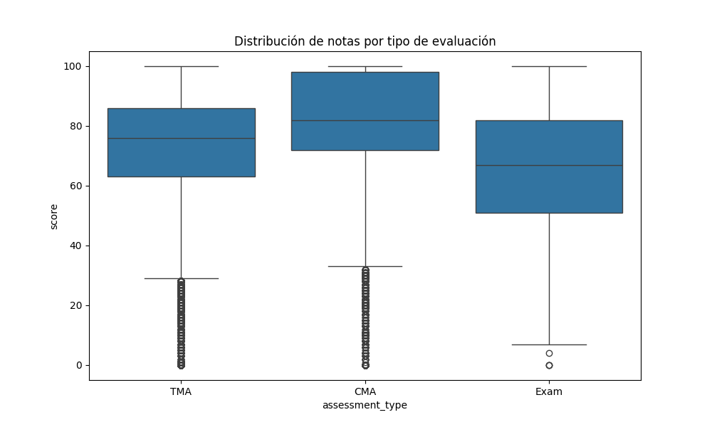
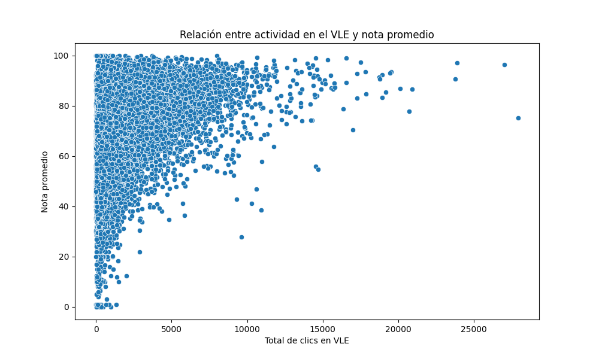
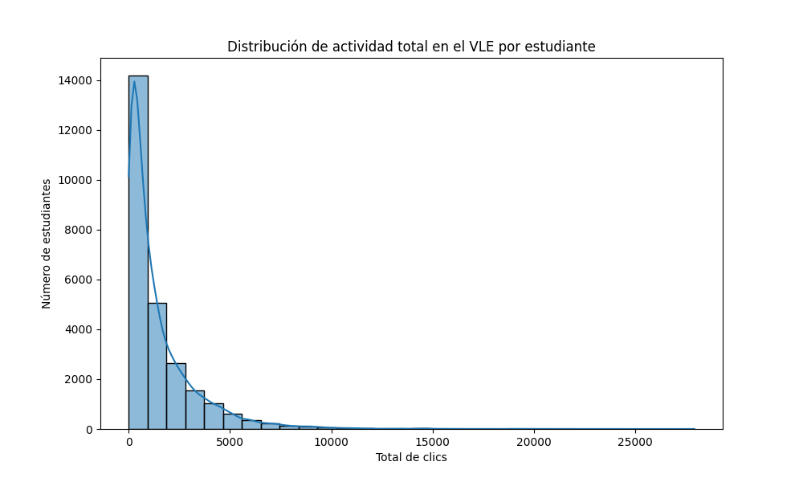
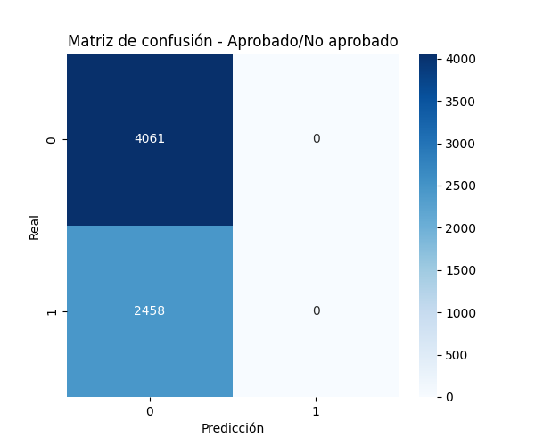
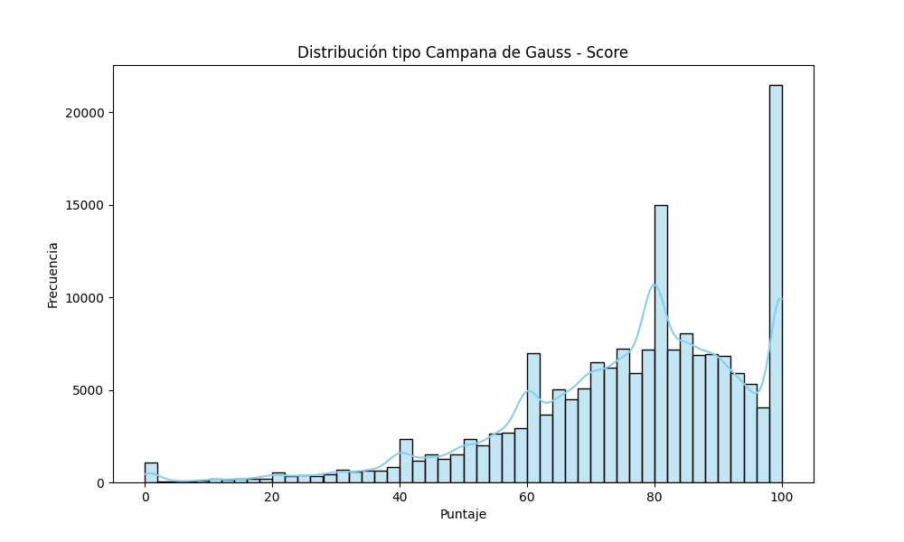
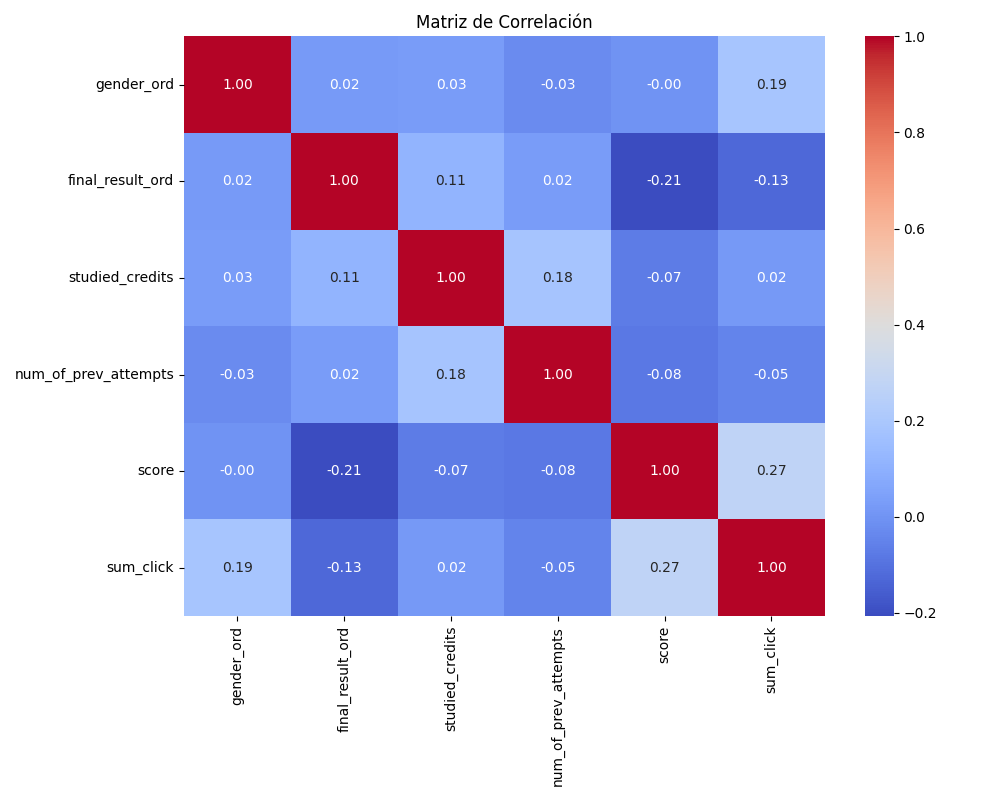
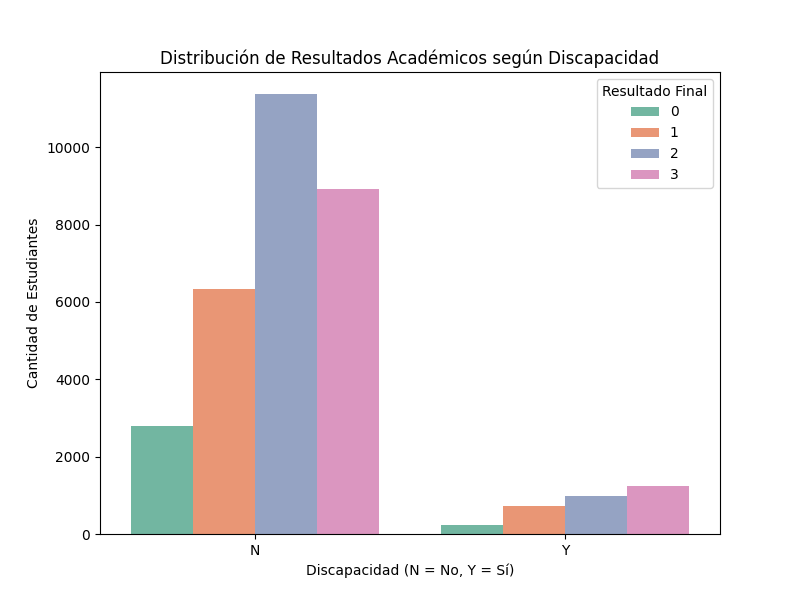

# 🧠📈 Caso Práctico 3 – OULAD - ETL & EDA con Ciencia de Datos

#### Maestría en Ciencia de Datos e Inteligencia Artificial (MACDIA)  
Materia: Ciencia de Datos I – INF-7303-C1  
###### Profesor: Silverio Del Orbe A.


---


## 🎯 Objetivo del Proyecto

Este repositorio contiene una solución modularizada para el Caso Práctico 3. El objetivo principal es ejecutar un proceso completo de ETL y EDA utilizando el dataset OULAD. Se incluye:

- Limpieza y transformación de datos.
- Codificación ordinal de variables categóricas.
- Carga de datos en una base de datos relacional MySQL.
- Construcción de modelo relacional con claves primarias y foráneas.
- Generación de FullDomain.
- Visualizaciones EDA (boxplot, histograma, correlaciones, dispersión, campana de Gauss, kurtosis, skewness, matriz de confusión).
- Pruebas automatizadas con `pytest`.

---

## 🛠️ Estructura del Proyecto

```
oulad-etl-eda/
├── data/                  # Archivos CSV originales
├── output/eda/            # Gráficos y reportes EDA
├── scripts/               # Scripts principales
│   └── run.py             # Punto de entrada del pipeline
├── src/
│   ├── eda/
│   │   ├── visualization.py
│   │   ├── correlation.py
│   │   └── stats_summary.py
│   ├── etl/
│   │   ├── extract.py
│   │   ├── transform.py
│   │   └── load.py
│   ├── common/
│   │   └── logger.py
│   └── config/
│       └── settings.py
├── test/
│   ├── test_extract.py
│   ├── test_load.py
│   └── test_visualization.py
├── schema.sql             # Script SQL para modelo relacional
├── requirements.txt       # Dependencias
├── README.md              # Documentación
```

---

## 🔧 Tecnologías Utilizadas

| Componente      | Tecnología          |
| --------------- | ------------------- |
| Lenguaje        | Python 3.12         |
| Visualizaciones | Matplotlib, Seaborn |
| Machine Learning| Scikit-Learn        |
| Base de Datos   | MySQL               |
| Testing         | Pytest              |
| IDE             | VS Code / PyCharm   |


---


## 🚀 Ejecución del Proyecto

1. **Clonar el repositorio**
```bash
git clone https://github.com/NCarrasco/oulad-etl-eda.git
cd oulad-etl-eda
```

2. **Crear entorno virtual**
```bash
python3 -m venv .venv
source .venv/bin/activate
```

3. **Instalar dependencias**
```bash
pip install -r requirements.txt
```

4. **Crear la base de datos MySQL**
```sql
CREATE DATABASE ouladdb;
```

5. **Ejecutar el proceso ETL y EDA**
```bash
python scripts/run.py
```

---

## 🧪 Ejecutar Tests

```bash
pytest test/
```

---

## 📊 Dataset

Descargar desde:  
[https://analyse.kmi.open.ac.uk/open-dataset/download](https://analyse.kmi.open.ac.uk/open-dataset/download)  
Colocar los archivos CSV en la carpeta `data/`.

---

## 👥 Autores

- Norman Yulifer Carrasco Medina  
- Miguel Mariano Pimentel Alcántara  
- Miguel Ángel Consoro Guzmán

---

## 📄 Licencia

Este proyecto está desarrollado con fines académicos para el curso "Ciencia de Datos I" de la Universidad Autónoma de Santo Domingo (UASD).

---

## 📓 Referencias

- https://pandas.pydata.org/
- https://scikit-learn.org/
- https://matplotlib.org/
- https://seaborn.pydata.org/
- https://dev.mysql.com/


## 📊 Visualizaciones generadas









